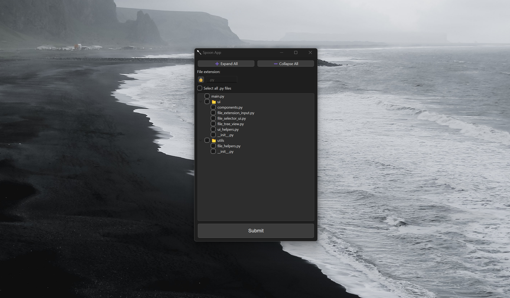

# ChatGPT-Feeder

**ChatGPT-Feeder** is a Python application built using PySide6 for selecting and processing Python project files. It features a graphical user interface (GUI) that allows users to browse, select, and manage Python files in a project, including options to expand/collapse the file tree and apply various operations on the selected files.

## Features

-   **File Selection**: Browse and select Python files from a project directory.
-   **Expand/Collapse**: Expand or collapse all directories in the file tree with a single click.
-   **Clipboard Integration**: Copy the contents of selected files to the clipboard.
-   **File Extension Filtering**: Lock and unlock file extensions to filter files in the tree.
-   **Persistent Selection**: Save and load file selections between sessions.
-   **Icons**: Uses a custom spoon emoji (`🥄`) as the app icon.

## Screenshots



## Installation

### Prerequisites

1. **Python**: Ensure you have Python 3.7 or higher installed.
2. **Dependencies**: Install the required Python packages listed in the `requirements.txt` file.

### Clone the Repository

```bash
git clone https://github.com/jiuvirgil/ChatGPT-Feeder.git
cd ChatGPT-Feeder
```

### Install Dependencies

Install the required Python packages using pip:

```bash
pip install -r requirements.txt
```

### Run the Application

Once the dependencies are installed, you can run the application:

```bash
python main.py
```

## Download the Executable

If you don't want to run the application from source, you can download the standalone executable from the [Releases](https://github.com/jiuvirgil/ChatGPT-Feeder/releases) page.

Simply download the latest release for your platform and run the executable.

## Usage

1. Launch the application.
2. Use the file tree to browse and select Python files in your project directory.
3. You can expand or collapse all directories using the `➕ Expand All` and `➖ Collapse All` buttons.
4. Filter files by file extension using the input field at the top.
5. After making your selection, click "Submit" to copy the contents of the selected files to the clipboard.

## Requirements

-   **Python 3.7+**
-   **PySide6**
-   **pyperclip**

These dependencies are listed in the `requirements.txt` file.

## Contributing

Contributions are welcome! If you find a bug or have a feature request, please open an issue. If you want to contribute code, feel free to fork the repository and submit a pull request.

## License

This project is licensed under the MIT License. See the [LICENSE](LICENSE) file for more details.

## Acknowledgments

-   Special thanks to the PySide6 and Python communities for providing the tools and libraries that make this application possible.
