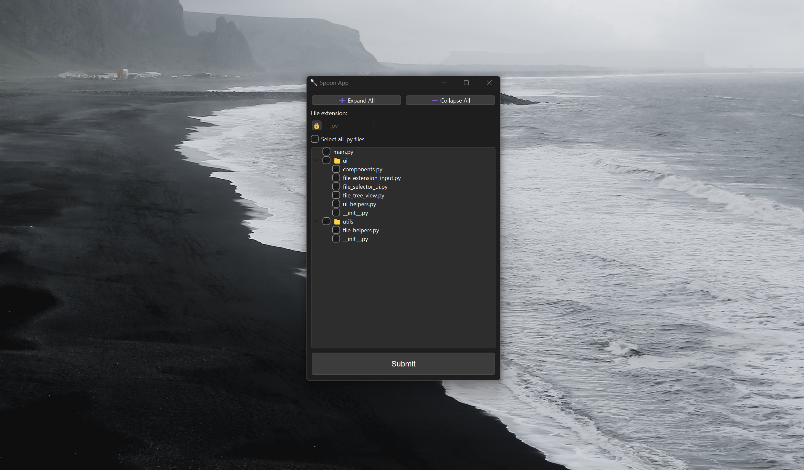

# ChatGPT-Feeder

<div align="center">
  
</div>

**ChatGPT-Feeder** is a Python application that streamlines the process of selecting and copying code files to your clipboard for use with ChatGPT. This tool provides an efficient way to prepare your project files for analysis, debugging, or assistance from AI language models.

Built with PySide6, ChatGPT-Feeder features a graphical interface that enables you to browse, select, and manage files in your project with options to expand/collapse the file tree and filter by extension.

> Developed by [Pazal Group](https://pazalgroup.com)

## Features

-   **File Selection**: Browse and select files from a project directory with support for multiple file types.
-   **Expand/Collapse**: Expand or collapse all directories in the file tree with a single click.
-   **Clipboard Integration**: Copy the contents of selected files to the clipboard in a single operation.
-   **File Extension Filtering**: Lock and unlock file extensions to filter files in the tree.
-   **Persistent Selection**: Save and load file selections between sessions.
-   **Search Functionality**: Filter files by name using the built-in search feature.

## Screenshots



## Quick Start

### Option 1: Download Executable (Easiest)

Download the latest release from the [Releases](https://github.com/jiuvirgil/ChatGPT-Feeder/releases) page and run the executable.

### Option 2: Run from Source

**Windows (PowerShell):**
```powershell
.\run.ps1
```

**Linux/macOS:**
```bash
chmod +x run.sh
./run.sh
```

The run script automatically handles:
- Python installation check
- Virtual environment creation
- Dependency installation
- Running the application

## Development

### Setup Development Environment

**Windows (PowerShell):**
```powershell
.\setup.ps1
```

**Linux/macOS:**
```bash
chmod +x setup.sh
./setup.sh
```

### Build Executable

**Windows (PowerShell):**
```powershell
.\build.ps1
```

The build script will:
- Create virtual environment if needed
- Install all dependencies
- Build executable with PyInstaller
- Output executable to `dist/` directory

### File Type Icons

The application uses VS Code Icons (MIT licensed) to display file type icons in the extension dropdown. To enable icons:

**Python (Recommended - Cross-platform):**
```bash
python download_icons.py
```

**Windows (PowerShell):**
```powershell
.\download_icons.ps1
```

Both scripts automatically download **all available** SVG icons from the [VS Code Icons repository](https://github.com/vscode-icons/vscode-icons) to `resources/icons/`. The scripts:
- Fetch the list of available icons from GitHub API
- Download all SVG icons (file_type, folder_type, default, etc.)
- Skip icons that already exist locally
- Work with the extension mapping in `src/utils/icons.py`

**Note:** The Python script requires the `requests` library. Install it with:
```bash
pip install requests
```
Or install all development dependencies:
```bash
pip install -r requirements-dev.txt
```

**Manual Setup:**
1. Download icons from [vscode-icons/vscode-icons](https://github.com/vscode-icons/vscode-icons/tree/master/icons/file_type)
2. Place SVG files in `resources/icons/` directory
3. Icons should follow VS Code naming: `file_type_{language}.svg` (e.g., `file_type_python.svg`)

The application will gracefully handle missing icons by displaying the extension without an icon. The extension-to-icon mapping is defined in `src/utils/icons.py` and serves as the single source of truth.

### Troubleshooting

- **Script execution fails on Windows**: Run `Set-ExecutionPolicy -ExecutionPolicy RemoteSigned -Scope CurrentUser` in PowerShell
- **Python not found**: Ensure Python 3.7+ is installed and [in your PATH](https://realpython.com/add-python-to-path/)
- **Build fails**: Run `.\setup.ps1` first to ensure all dependencies are installed
- **Missing DLL errors**: Install [Visual C++ Redistributables](https://learn.microsoft.com/en-us/cpp/windows/latest-supported-vc-redist) on Windows

## Usage

1. Launch the application.
2. Use the file tree to browse and select files in your project directory.
3. Expand or collapse directories using the Expand All and Collapse All buttons.
4. Filter files by file extension using the extension filter input field.
5. Optionally use the search field to filter files by name.
6. After making your selection, click "Submit" to copy the contents of the selected files to the clipboard.

## Requirements

### Runtime Requirements

-   **[Python 3.7+](https://www.python.org/downloads/)**
-   **PySide6** - GUI framework
-   **pyperclip** - Clipboard operations

These dependencies are listed in the `requirements.txt` file.

### Development Requirements

For building the executable, additional dependencies are required:
-   **PyInstaller** - Executable builder
-   **pyinstaller-hooks-contrib** - Additional PyInstaller hooks
-   **pillow** - Image processing (for icon handling)
-   **altgraph**, **pefile**, **packaging** - PyInstaller dependencies

All development dependencies are listed in `requirements-dev.txt`.

## Contributing

Contributions are welcome! If you find a bug or have a feature request, please open an issue. If you want to contribute code, feel free to fork the repository and submit a pull request.

## License

This project is licensed under the MIT License. See the [LICENSE](LICENSE) file for more details.

## Acknowledgments

-   Developed by [Pazal Group](https://pazalgroup.com)
-   Built with [PySide6](https://www.qt.io/qt-for-python) for the GUI framework
-   Thanks to [PyInstaller](https://www.pyinstaller.org/) for enabling standalone executable builds
-   Thanks to [pyperclip](https://github.com/asweigart/pyperclip) for clipboard functionality
